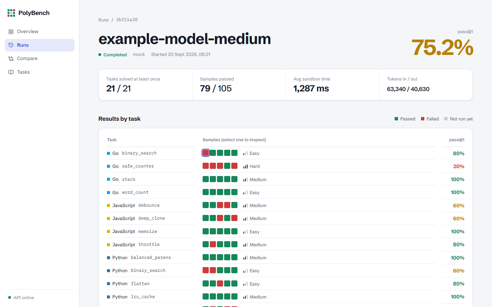
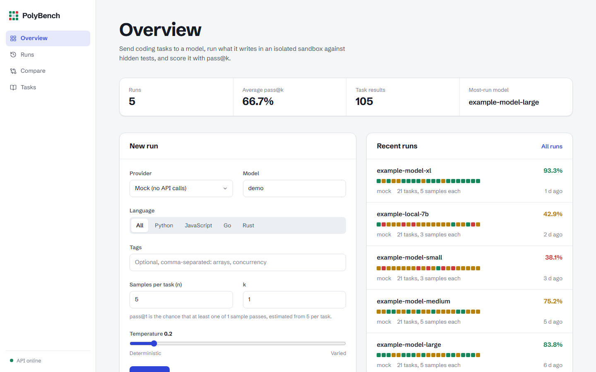
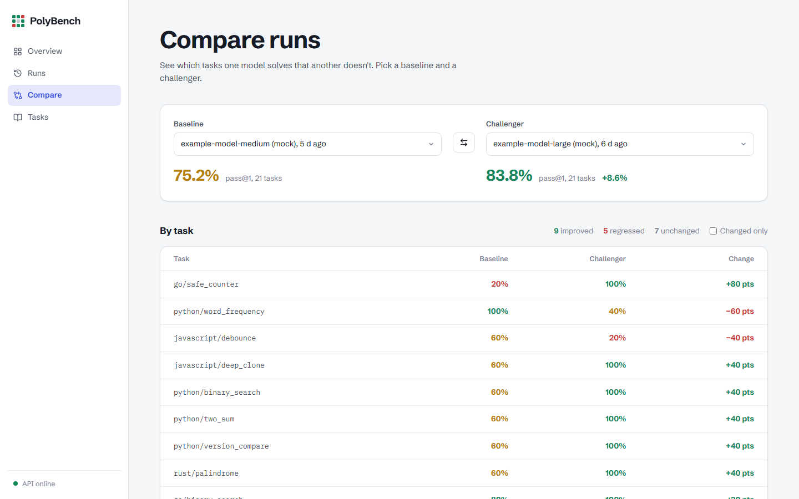

# PolyBench

PolyBench measures how well large language models write working code. It sends programming tasks to a model, pulls the code out of the response, runs it in an isolated Docker sandbox against a test suite the model never sees, and scores the results with pass@k. Every failure is classified: the code couldn't be extracted, didn't compile, crashed, gave the wrong output, timed out, used too much memory, or tried something the sandbox blocks.

It ships with 21 tasks in Python, JavaScript, Go and Rust, and works with Anthropic, OpenAI and any OpenAI-compatible provider, including local models through Ollama and LM Studio.

You can drive it three ways:

- **Dashboard**: a Next.js web app for starting runs, inspecting every sample, and comparing models task by task.
- **CLI**: `polybench run`, `compare`, `report`, `export` and more, with terminal and HTML reports.
- **MCP server**: lets an AI agent such as Claude Desktop list tasks, start runs and read results.

## Dashboard

Each run is shown as a grid with one row per task and one square per sample. Green squares passed and red ones failed. Select any square to see the code the model wrote, what the sandbox printed, and why the sample failed.



| Overview | Compare runs |
| --- | --- |
|  |  |

The dashboard follows your system's light or dark setting ([dark mode screenshot](docs/screenshots/run-dark.png)). Screenshots use synthetic demo data, not real model results.

## How it works

```
 task (prompt + signature)
        │
        ▼
 ┌──────────────┐   n samples   ┌──────────────┐   code   ┌─────────────────┐   pass/fail   ┌──────────┐
 │ LLM provider │ ────────────▶ │ extract code │ ───────▶ │ Docker sandbox  │ ────────────▶ │ scoring  │
 └──────────────┘               └──────────────┘          │ + hidden tests  │               │ pass@k + │
                                                          └─────────────────┘               │ taxonomy │
                                                                                            └──────────┘
```

For each task the model is sampled `n` times. pass@k is the probability that at least one of `k` samples passes, computed with the unbiased estimator from the HumanEval paper:

```
pass@k = 1 − C(n − c, k) / C(n, k)      (c = samples that passed; 1.0 when n − c < k)
```

A run's score is the mean pass@k across its tasks.

### Sandbox isolation

Generated code is untrusted, so it never runs on the host through `exec` or `eval`. Each sample runs in a throwaway container with:

- no network access (`--network none`)
- no access to the host filesystem
- memory, CPU and process limits (256 MB and 1 CPU by default, set in `src/polybench/sandbox/policy.py`)
- a non-root user with Linux capabilities dropped
- a wall-clock timeout per task

Run `polybench sandbox-test` to check these limits on your machine.

## Requirements

- Python 3.11 or later and [uv](https://docs.astral.sh/uv/)
- Docker, running, for the sandbox
- Node.js 20 or later, for the dashboard
- An API key for any hosted provider you want to test. The `mock` provider needs no key and is useful for trying things out.

## Quickstart

All commands run from the `polybench/` directory.

```bash
cd polybench
uv sync --all-extras --dev
cp .env.example .env          # add the API keys you plan to use
uv run polybench setup        # builds the sandbox images
```

### From the command line

```bash
# Preview which tasks a run would include
uv run polybench run --provider mock --model demo --dry-run

# 5 samples per task, scored as pass@1, Python tasks only
uv run polybench run --provider anthropic --model claude-sonnet-4-6 -n 5 -k 1 --lang python

uv run polybench history           # recent runs
uv run polybench compare --run-a RUN_A --run-b RUN_B
uv run polybench report --run-id RUN_ID --out report.html
```

Run `uv run polybench --help` for the full list of commands, including `tasks list`, `tasks validate`, `keys`, `export` and `compass` (checks which providers are reachable).

### With the dashboard

Start the API, then the web app in a second terminal:

```bash
uv run uvicorn polybench.api.main:app --port 8080
```

```bash
cd web
npm install
npm run dev
```

Open http://localhost:3000. If `POLYBENCH_DASHBOARD_PASSWORD` is set in `.env`, the browser asks for it; any username works.

### With Docker Compose

```bash
cd polybench
docker compose up -d --build
```

This starts Postgres, the API and the dashboard. The dashboard is at http://localhost:3000.

### From an AI agent (MCP)

Add PolyBench to your MCP client's configuration, for example `claude_desktop_config.json`:

```json
{
  "mcpServers": {
    "polybench": {
      "command": "uv",
      "args": ["run", "python", "-m", "polybench.server"],
      "cwd": "/absolute/path/to/Polybench/polybench"
    }
  }
}
```

The server exposes tools to list and validate tasks, start a benchmark run, fetch a run and its per-task results, and compare two runs.

## Providers

| Provider | `--provider` | Needs |
| --- | --- | --- |
| Anthropic | `anthropic` | `ANTHROPIC_API_KEY` |
| OpenAI | `openai` | `OPENAI_API_KEY` |
| Groq, Together, Mistral, DeepSeek, xAI, Gemini, Fireworks, Perplexity | `groq`, `together`, `mistral`, `deepseek`, `xai`, `gemini`, `fireworks`, `perplexity` | the matching `*_API_KEY` |
| Ollama | `ollama` | a running Ollama server (`OLLAMA_BASE_URL`) |
| LM Studio | `lmstudio` | a running LM Studio server (`LMSTUDIO_BASE_URL`) |
| Mock | `mock` | nothing; returns canned responses |

## Configuration

Settings come from environment variables or `polybench/.env`. See [`.env.example`](polybench/.env.example) for the full list.

| Variable | Default | Purpose |
| --- | --- | --- |
| `POLYBENCH_DB` | `./polybench.db` | SQLite database for runs and results |
| `POLYBENCH_DEFAULT_MODEL` | `claude-sonnet-4-6` | model used when `--model` is omitted |
| `POLYBENCH_DASHBOARD_PASSWORD` | unset | if set, protects the dashboard and API with basic auth |
| `POLYBENCH_MAX_CONCURRENT_RUNS` | `1` | runs the API will execute at once |
| `POLYBENCH_SANDBOX_WORKERS` | `4` | samples run in parallel within a run, one container each |

## Adding tasks

Each task is a JSON file in `polybench/tasks/<language>/` with an `id`, `title`, `prompt`, the `signature` the model must implement, hidden `test_code`, `difficulty`, `tags` and `timeout_seconds`. Copy an existing task as a template, then check it:

```bash
uv run polybench tasks validate
```

See [CONTRIBUTING.md](CONTRIBUTING.md) for details, and [#15](https://github.com/Jason-jo17/Polybench/issues/15) for task ideas.

## Repository layout

```
polybench/
├── src/polybench/     # engine, providers, sandbox runner, scoring, CLI, API, MCP server
├── tasks/             # benchmark tasks, one JSON file each
├── sandbox/           # Dockerfiles for the Python, Node, Go and Rust sandboxes
├── tests/             # pytest suite, including property-based tests
└── web/               # Next.js dashboard
```

## Development

```bash
cd polybench
uv run pytest                  # tests
uv run ruff check . && uv run ruff format --check .
uv run mypy src                # strict type checking
pre-commit install             # run ruff and mypy on every commit
```

```bash
cd polybench/web
npm run lint && npm run build
```

CI runs all of these on every push and pull request to `main`.

## Contributing

Contributions are welcome, whether that's fixing a bug, adding a benchmark task or improving the dashboard.

- **Where to start:** the pinned issue [Start here: known issues and where to help](https://github.com/Jason-jo17/Polybench/issues/19) lists everything that's known to be broken or planned, in a suggested order.
- **Small first changes:** issues labelled [`good first issue`](https://github.com/Jason-jo17/Polybench/labels/good%20first%20issue).
- **How to contribute:** setup, checks and pull request guidelines are in [CONTRIBUTING.md](CONTRIBUTING.md).
- **Security problems** such as sandbox escapes: report privately, as described in [SECURITY.md](SECURITY.md).

**Project status:** early. The core pipeline works, but CI currently fails on lint, type checks and coverage, and `polybench run` has a known crash ([#3](https://github.com/Jason-jo17/Polybench/issues/3)). Fixing these is the top priority in the start-here issue.

## License

[MIT](LICENSE)
